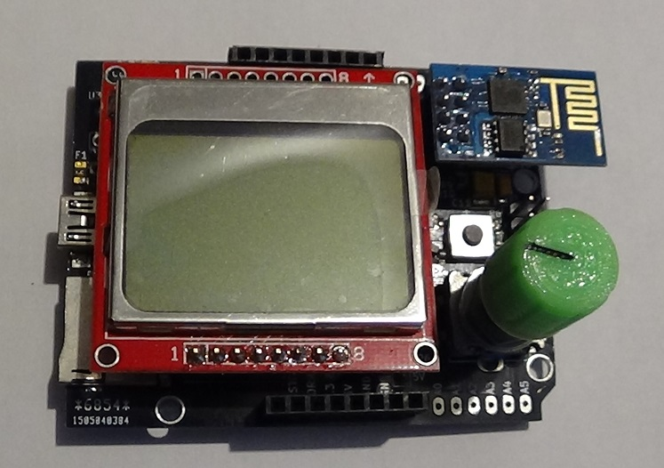
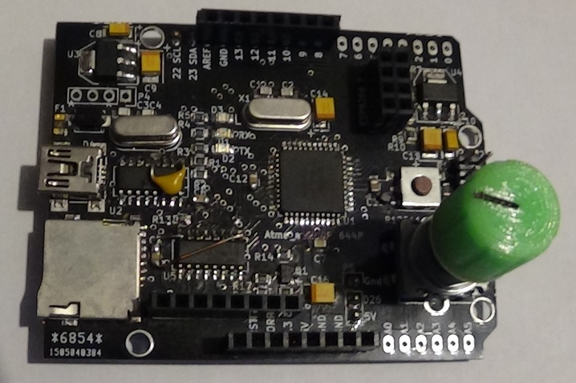
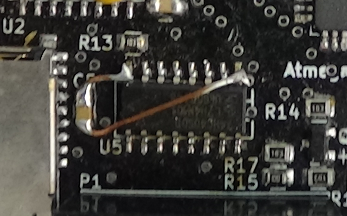
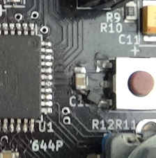
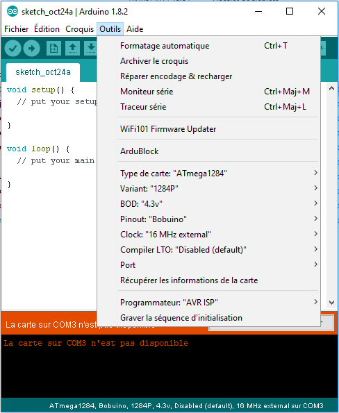

# bobuino
Carte compatible Arduino à base d'atmega 1284 arduino

rev1 (/v1backup)
- sur U5 vcc et gnd sont inversés !!!

- D1 & D2 s'allument lorsqu'il n'y a pas de trafic sur le port série
- il manque une diode 1n4148 entre vcc and rst

rev2 
- correction des connexion pour U5, D1, D2 et D5

## Comment installer MightyCore dans l'IDE Arduino
#### à partir du gestionnaire de carte
Cette methode d'installation requier la version 1.6.4 'ou supperieur) de l'IDE Arduino.
* Ouvrir l'IDE Arduino.
* Ouvrir le menu **Ficher > Préférences**.
* Entrer L'URL suivante dans **URL de gestionnaire de cartes supplémentaires**: `https://mcudude.github.io/MightyCore/package_MCUdude_MightyCore_index.json`
  * Separer les URLs par une virgule ( **,** ) si vous utilisez plusieurs URL
* Ouvrir le menu **Outils > Type de carte > Gestionnaire de cartes**.
* Attendre la fin du téléchargement.
* Faire défiler l'ascenseur jusqu'à **MightyCore** et cliquez dessus.
* Cliquez sur le bouton **Installer**.
* Apres l'installation Fermer la fenetre **Gestionnaire de carte**.

#### Installation manuelle
Sur [github.com/MCUdude/MightyCore] (https://github.com/MCUdude/MightyCore)
Cliquez sur le bouton "Download ZIP" . Extraire le fichier ZIP, et déplacer le répertoire dans "**~/Documents/Arduino/hardware**". Créer le répertoire "hardware" s'il n'existe pas.
Ouvrir l'IDE Arduino, dans le menu type de carte, une novelle catégorie appelée "MightyCore" apparai.

