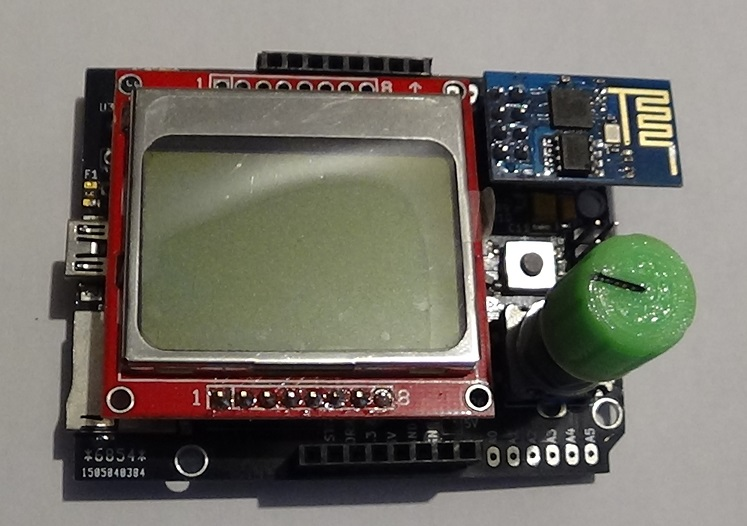

[:fr:](LISEZMOI.md) [:uk:](README.md)

# bobuino
atmega 1284 arduino compatible

design inspired from [Croos Road Fencing Center](http://www.crossroadsfencing.com/BobuinoRev17/) work

features:

- microSD card
- lcd display 82x48 pixels
- rotary encoder
- wifi esp8266

## Revisions

rev1 (/v1backup)
- U5 vcc and gnd are inverted !!!

- D1 & D2 light when inactive
- 1n4148 is missing between vcc and rst

rev2 
- correct connection for U5, D1, D2 and D5

## How to install MightyCore
#### Boards Manager Installation
This installation method requires Arduino IDE version 1.6.4 or greater.
* Open the Arduino IDE.
* Open the **File > Preferences** menu item.
* Enter the following URL in **Additional Boards Manager URLs**: `https://mcudude.github.io/MightyCore/package_MCUdude_MightyCore_index.json`
  * Separate the URLs using a comma ( **,** ) if you have more than one URL
* Open the **Tools > Board > Boards Manager...** menu item.
* Wait for the platform indexes to finish downloading.
* Scroll down until you see the **MightyCore** entry and click on it.
* Click **Install**.
* After installation is complete close the **Boards Manager** window.

#### Manual Installation
On https://github.com/MCUdude/MightyCore , 
Click on the "Download ZIP" button. Extract the ZIP file, and move the extracted folder to the location "**~/Documents/Arduino/hardware**". Create the "hardware" folder if it doesn't exist.
Open Arduino IDE, and a new category in the boards menu called "MightyCore" will show up.

### Configuration

